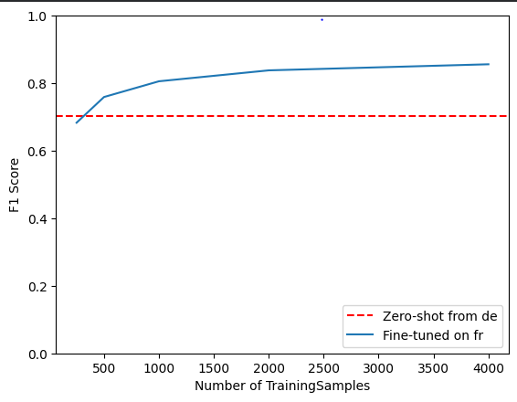

## OVERVIEW

이 프로젝트는 **XLM-RoBERTa(XLM-R)** 모델을 기반으로,  
**다국어 개체명 인식(NER)** 태스크에서 언어 간 전이학습(Cross-Lingual Transfer Learning)의 효과를 체계적으로 검증하는 실험을 해봤습니다.  

특히, **저자원 언어 환경**에서 모델이 얼마나 효율적으로 일반화할 수 있는지를 관찰하기 위해  
다음 네 가지 학습 전략을 동일한 파이프라인에서 비교했습니다.

- **Zero-shot Transfer**: 독일어 데이터로만 학습한 모델을 프랑스어, 이탈리아어, 영어 등 다른 언어에 직접 적용  
- **Few-shot Transfer**: 소량의 타겟 언어(프랑스어) 데이터를 점진적으로 추가해 성능 향상 곡선 관찰  
- **Multilingual Fine-tuning**: 두 개 이상의 언어(예: 독일어 + 프랑스어)를 동시에 학습시켜 교차 일반화 효과 분석  
- **Full Fine-tuning**: 모든 언어 데이터를 통합해 모델을 완전 미세조정, 최대 성능 한계 측정  

실험에는 **PAN-X(WikiAnn)** 데이터셋의 **독일어(de)**, **프랑스어(fr)**, **이탈리아어(it)**, **영어(en)** 데이터를 사용했으며,  
언어별 데이터 비율을 의도적으로 불균형하게 조정하여 실제 글로벌 환경에서의 모델 적응 시나리오를 모사했습니다.  

모든 실험은 동일한 모델 구조, 동일한 하이퍼파라미터 설정하에서 수행되어  
**데이터 크기, 언어 조합, 학습 전략에 따른 전이 성능 차이**를 정량적으로 비교할 수 있도록 설계되었습니다.  

이 프로젝트를 통해 다음과 같은 주요 질문을 검증했습니다:
1. 한 언어로 학습된 XLM-R 모델이 다른 언어에 어느 정도 일반화되는가?  
2. 타겟 언어 데이터가 얼마나 있어야 Zero-shot을 능가하는가?  
3. 다국어 동시 학습이 개별 언어 성능에 어떤 영향을 미치는가?  

이를 통해 **데이터 효율성과 언어 일반화 사이의 균형점**을 찾고,  
**다국어 NER 전이학습의 실무적 적용 가능성**을 제시하는 것을 목표로 했습니다.

## TRAINING PIPELINE

모든 실험은 동일한 모델 구조와 하이퍼파라미터 설정하에서 수행되어,  
전이 전략의 차이에 따른 성능 변화만을 비교할 수 있도록 설계되었습니다.  
파이프라인은 다음 5단계로 구성됩니다.

1. **데이터 전처리 (Token-Label Alignment)**  
   XLM-RoBERTa는 서브워드 단위 토크나이저를 사용하기 때문에,  
   단어 단위 레이블을 서브워드 단위로 재정렬하는 과정이 필요합니다.  
   각 단어의 첫 번째 서브워드에는 원본 레이블을 부여하고,  
   나머지 서브워드는 손실 계산에서 제외하기 위해 `-100`으로 마스킹했습니다.  
   이를 통해 모델이 토큰 수준이 아닌 **단어 단위 NER 인식**을 학습하도록 했습니다.

2. **데이터 인코딩**  
   Hugging Face `Datasets`의 `map()` 함수를 활용하여  
   전처리 함수를 모든 데이터 split(train, validation, test)에 병렬 적용했습니다.  
   이 단계에서 `'tokens'`, `'langs'`, `'ner_tags'` 등의 원본 컬럼을 제거하고  
   모델 입력에 필요한 텐서 형식(`input_ids`, `attention_mask`, `labels`)으로 변환했습니다.

3. **모델 정의**  
   `XLM-RoBERTa Base`를 기반으로 토큰 분류용 헤드를 추가했습니다.  
   이 헤드는 Dropout 층과 Linear 분류층으로 구성되어 있으며,  
   각 토큰의 은닉 벡터(hidden state)에 대해 NER 레이블 확률을 출력합니다.  
   손실 함수는 `CrossEntropyLoss`를 사용하여 각 토큰 단위의 분류 오차를 계산했습니다.

4. **학습 구조**  
   Hugging Face의 `Trainer` API를 이용해 학습 및 검증 과정을 자동화했습니다.  
   학습 파라미터는 다음과 같습니다.  
   - 학습률: 5e-5  
   - Epoch: 3  
   - Batch size: 16  
   - Weight decay: 0.05  
   - Evaluation strategy: `"epoch"`  
   학습 중 매 epoch마다 검증 F1-score를 계산하며,  
   최적 모델 가중치는 자동으로 저장되었습니다.

5. **평가 방식**  
   모델 출력(logits)을 argmax 연산으로 변환한 뒤,  
   `seqeval` 라이브러리를 이용해 **엔티티 단위 F1-score**를 계산했습니다.  
   손실 계산에서 제외된 `-100` 토큰은 평가에서도 무시됩니다.  
   이 지표를 통해 언어별, 데이터 규모별 전이 성능을 비교했습니다.

---

## RESULTS

이번 연구에서는 XLM-RoBERTa 모델을 기반으로 교차 언어 전이 성능을 단계적으로 비교했습니다.  
모든 모델은 동일한 하이퍼파라미터(3 epoch, batch size 16, lr=5e-5)에서 학습되었습니다.

---

### Zero-Shot Transfer (de → others)

독일어 데이터로만 미세튜닝한 모델을  
프랑스어, 이탈리아어, 영어 데이터셋에 직접 적용해 전이 성능을 평가했습니다.

| Evaluated on | de | fr | it | en |
|:--------------|---:|---:|---:|---:|
| **Fine-tuned on de** | **0.8752** | 0.7040 | 0.6945 | 0.6063 |

- 독일어에서는 F1-score 0.875로 가장 높은 성능을 보였으며,  
  프랑스어와 이탈리아어로 전이 시 약 17~18% 하락,  
  영어에서는 언어 구조 차이로 약 27% 하락이 관찰되었습니다.
- **게르만어 ↔ 로망어 간 전이**에서 구조적 한계가 존재함을 확인했습니다.

---

### Few-Shot Transfer (프랑스어 데이터 증가 실험)

프랑스어 데이터셋을 단계적으로 확장(250 → 4000 샘플)하여  
Zero-shot 대비 성능 향상 곡선을 관찰했습니다.

| 샘플 수 | 250 | 500 | 1000 | 2000 | 4000 |
|:--------:|:--:|:--:|:--:|:--:|:--:|
| **F1-score (fr)** | 0.6289 | 0.7604 | 0.8336 | 0.8497 | **0.8655** |

- **임계점:** 약 **750~1000개** 샘플에서 Zero-shot 수준(0.704)을 초과  
- 데이터가 증가함에 따라 F1-score가 점진적으로 향상되었으나  
  **2000개 이후부터는 개선 폭이 완만해짐 (수익 체감 구간 진입)**

---

### Multilingual Fine-Tuning (de + fr)

독일어와 프랑스어 데이터를 동시에 학습하여  
언어 간 지식 공유와 일반화 효과를 검증했습니다.

| Evaluated on | de | fr | it | en |
|:--------------|---:|---:|---:|---:|
| **Fine-tuned on (de+fr)** | 0.876 | 0.865 | 0.704 | 0.661 |

- **프랑스어 성능이 Zero-shot 대비 약 +16%p 향상 (0.704 → 0.865)**  
- 독일어는 성능 유지,  
- 이탈리아어·영어에서도 미세한 전이 이득(약 +5%)이 관찰되었습니다.  
- 다국어 병렬 학습이 **언어 간 표현 공간을 강화**시킴을 확인했습니다.

---

### Full Multilingual Fine-Tuning 

모든 언어 데이터를 통합 학습하여  
가장 균형 잡힌 전이 성능을 달성했습니다.

| Evaluated on | de | fr | it | en |
|:--------------|---:|---:|---:|---:|
| **Fine-tuned on all languages** | 0.8754 | 0.8649 | 0.8688 | 0.7832 |

- 모든 언어에서 **F1-score 약 0.78~0.87 수준의 균형적 성능** 확보  
- 특정 언어에 과도하게 편향되지 않고,  
  **언어 간 공통 표현이 강화된 일반화 모델**로 발전함을 확인했습니다.

---

## INSIGHTS

1. **Zero-shot의 효율성**  
   - 독일어 학습만으로도 타 언어에 즉시 적용 가능 (평균 F1 ≈ 0.72)  
   - 저자원 언어 환경에서 초기 배포에 적합  

2. **Few-shot의 임계점 발견**  
   - 750~1000개의 샘플만으로 Zero-shot을 초과  
   - 4000개까지 확장 시 0.86 이상 도달 → **비용 대비 성능 개선 한계 확인**

3. **Multilingual 학습의 시너지 효과**  
   - 언어 간 공유 표현 강화로 프랑스어·이탈리아어 성능 모두 향상  
   - 학습에 포함되지 않은 언어(영어)에서도 **전이 일반화 효과 발생**

4. **Full multilingual의 균형성**  
   - 개별 언어 편향 없이 모든 언어에서 균형 잡힌 성능 확보  
   - 실제 글로벌 환경에서의 **범용 NER 모델 설계 가능성** 확인  

5. **전이 성능에 영향을 주는 주요 요인**  
   - 언어 계열 간 거리 (게르만어 ↔ 로망어)  
   - 토크나이저의 서브워드 분절 차이  
   - 엔티티 라벨 분포 불균형  

---

## CONCLUSION

이번 프로젝트를 통해 단순히 모델의 성능 수치를 비교하는 것을 넘어,  
**언어 간 전이학습이 실제로 어떻게 작동하는지**를 깊이 이해할 수 있었습니다.  

특히 처음에는 한 언어에서 학습된 모델이  
다른 언어에서도 잘 동작할 거라 예상했지만,  
**언어 계열 간 구조적 차이(게르만어 ↔ 로망어)**가 성능에 큰 영향을 준다는 점을 직접 확인했습니다.  

Few-shot 실험에서는 **데이터의 양보다 질과 다양성이 더 중요하다**는 사실을 배웠고,  
불과 몇 백 개의 예시만으로도 모델이 빠르게 적응한다는 점이 인상적이었습니다.  
또한 Multilingual 학습을 진행하면서  
서로 다른 언어가 **모델 내부에서 공통 표현 공간을 공유하며 일반화 능력을 높이는 과정**이  
데이터로 증명되는 걸 직접 보는 흥미로운 경험이었습니다.  

마지막으로 Full fine-tuning 단계에서  
모든 언어가 균형 있게 성능을 보이는 결과를 얻으면서,  
“단일 언어 최적화”보다 **다언어 협력 기반의 학습이 실제로 더 강력하다**는 확신을 갖게 되었습니다.  

이 실험을 통해 단순한 성능 향상보다  
**언어 간 지식 전이와 모델의 일반화 능력**이라는  
보다 근본적인 문제를 탐구하는 시야를 가지게 되었고,  
앞으로는 이런 전이학습 개념을 **멀티모달 환경**으로 확장해보고 싶습니다.
